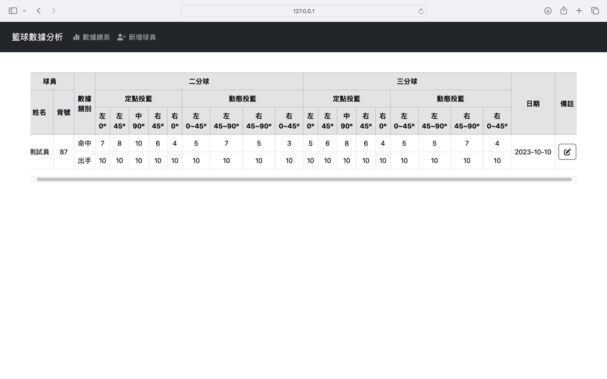

# 投籃數據分析
使用簡單的頁面記錄投籃數據，並輸出計算命中率，收集一段時間的數據後，開始分析這一段時間內此數據的命中率趨勢，從中觀察此球員的命中率穩定度如何、團隊中哪位球員的命中率最穩定等
## 使用工具
HTML/CSS/JavaScript/python/SQL資料庫
## 架構
首先利用到Python的flask套件，通常會有 app.py 跟 template、static 兩個資料夾
* static 用來放 css 和 js 檔
* template 用來放 html 檔

### **app.py** 
是 Flask 應用程式的核心，其中包含了應用程式的主要配置和邏輯，並負責啟動整個應用。

引入 Python 內建的 sqlite3 模組，之後將會使用到 SQLite3 資料庫，接著定義一個處理根路徑的函式，當用戶訪問網站時，會進入 'index.html' 的模板檔案。最後連接了一個 SQLite3 資料庫的函式，確保在使用資料庫時能正確地建立連線。

  * 執行app.py，可看到目前所設計的頁面

 

### **base.html**
[基本結構](basketball/templates/base.html)

base.html 這個檔案定義了整個網頁的結構，包括了 HTML的基本設定、頁面的標題、連結到 CSS 和 JavaScript 的引用，以及 Bootstrap 和 jQuery 來建立網頁外觀和提供動態功能。

## 對數頻譜分析

1. **濾波結果**：如果對數頻譜在濾波器的通帶外顯示了一條平線，則表明濾波器有效地衰減了那些頻率。
2. **驗證正確性**：要證明對數頻譜顯示了正確的濾波結果，可以將這些結果與濾波器的理論響應進行比較。實際結果應該與基於濾波器設計的
