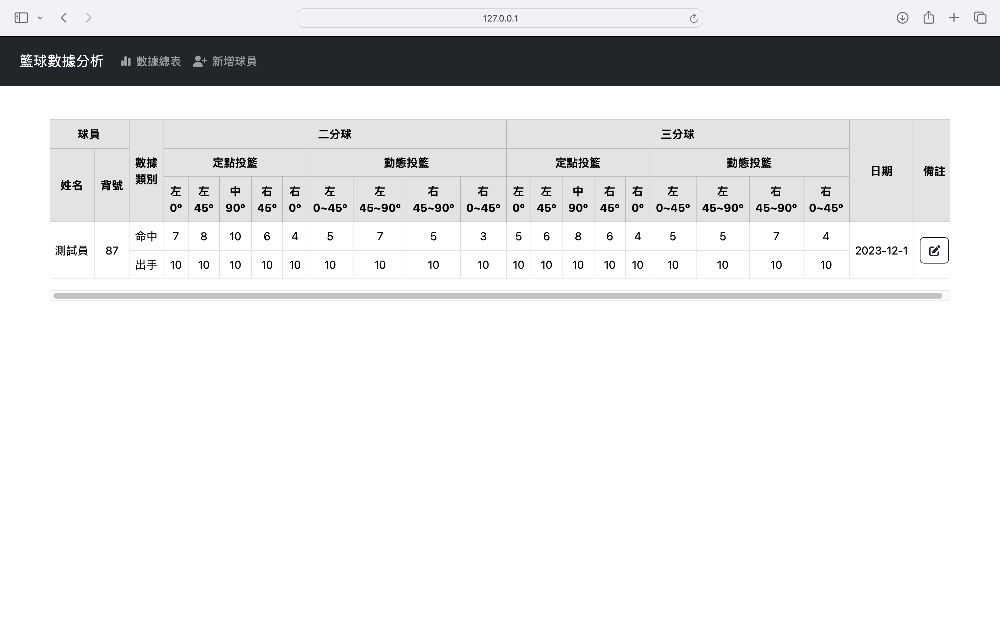

# 投籃數據分析
使用簡單的頁面記錄投籃數據，並輸出計算命中率，收集一段時間的數據後，開始分析這一段時間內此數據的命中率趨勢，從中觀察此球員的命中率穩定度如何、團隊中哪位球員的命中率最穩定等
## 使用工具
HTML/CSS/JavaScript/python/SQL資料庫
## 架構
首先利用到Python的flask套件，通常會有 app.py 跟 template、static 兩個資料夾
* static 用來放 css 和 js 檔
* template 用來放 html 檔

### **app.py** 
[主核心](basketball/app.py)

app.py => 是 Flask 應用程式的核心，其中包含了應用程式的主要配置和邏輯，並負責啟動整個應用。

引入 Python 內建的 sqlite3 模組，之後將會使用到 SQLite3 資料庫，接著定義一個處理根路徑的函式，當用戶訪問網站時，會進入 'index.html' 的模板檔案。最後連接了一個 SQLite3 資料庫的函式，確保在使用資料庫時能正確地建立連線。

  * 執行app.py，可看到目前所設計的頁面

 

### **base.html**
[基本結構](basketball/templates/base.html)

base.html => 此檔案定義了整個網頁的結構，包括了 HTML 的基本設定、頁面的標題、連結到 CSS 和 JavaScript 的引用，以及 Bootstrap 和 jQuery 來建立網頁外觀和提供動態功能。

### **index.html**
[數據表格](basketball/templates/index.html)

index.html =>  此檔案主要用於顯示數據的表格，並提供了備註，可以做編輯的功能。

### **navbar.html**
[導覽列](basketball/templates/navbar.html)

navbar.html => 此檔案的設計能夠在不同尺寸的螢幕上呈現出適應性，並包含標題、導覽按鈕，以及導覽項目的清單，讓用戶可以使用網站的不同功能。

## 目前使用到 bootstrap、jquery、font awesome
* **bootstrap**: 提供了預先設計好的 CSS 和 JavaScript 組件，可以快速構建網頁設計。
* **jquery**:  JavaScript 函式庫，簡化了與 HTML 文件之間的操作，能夠建立動態網頁。
* **font awesome**: 提供各種網頁圖標的字體庫，可以輕鬆地將向量圖示嵌入網站，並使用 CSS 控制其樣式和大小。

## 初步網頁的設計草稿
    登入頁面

    選擇用途

    數據查詢頁面

    新增數據

    新增數據頁面

    已儲存數據頁面

## 其它
**`資料庫的設計`**

**`如何計算命中率，並呈現`**

**`功能的設置`**
 * 頁面如何切換
 * 按鈕的運作
 * 資料的輸入
